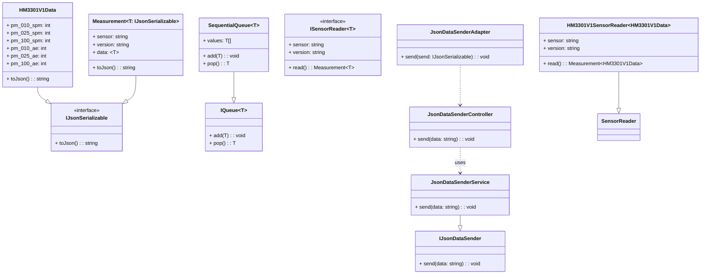
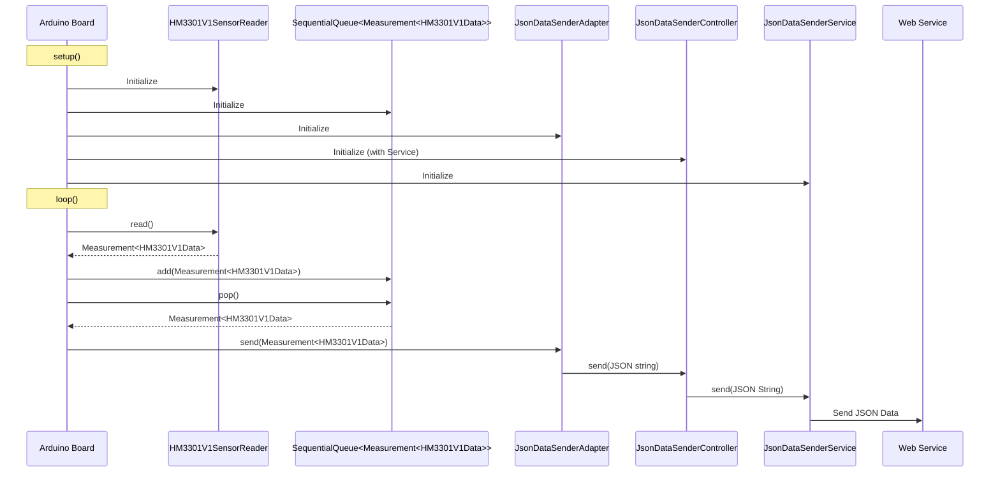

# grove_sensor_arduino_nano_esp32

Testing the Grove  - Laser PM2.5 Sensor with an Arduino Nano ESP32

## Getting Started

### Install the PlatformIO IDE VSCode Extension

Install the PlatformIO IDE extension from the VSCode extension marketplace (see workspace recommendations). You may be asked to install Python. You may follow the instructions [here](https://docs.platformio.org/en/latest/faq/install-python.html).

### Initialize the Project

In this example a PlatformIO project has already been created. The project configuration can be inspected in the [platformio.ini](./platformio.ini) file.

The `platformio` (or `pio`) command-line interface should be installed along the the extension. For the local development purposes you need to intialize the  command-line interface. Execute the following commands in the command-line:

```bash
pio project init
```

Note: The command-line has to be a PlatformIO terminal. You can create a new PlatformIO termincal by pressing the `PlatformIO: New Terminal` buttom in the bottom left of your VSCode window.

Run the `pio check` command to do a static code analysis to check if everything is setup correctly.

### Connect the Hardware

For the project you need to have a:

- [Grove - Laser PM2.5 Sensor (HM3301)](https://wiki.seeedstudio.com/Grove-Laser_PM2.5_Sensor-HM3301/)
- [Ardunino Nano ESP32](https://docs.arduino.cc/tutorials/nano-esp32/cheat-sheet/)

Connect the Grove laser sensor according to the [offical instructions](https://wiki.seeedstudio.com/Grove-Laser_PM2.5_Sensor-HM3301/) to the Arduino Nano ESP32:

| Arduino Nano ESP32 | Grove Cable | Grove - Laser PM2.5 Sensor (HM3301) |
|--------------------|-------------|-------------------------------------|
| GND                | Black       | GND                                 |
| 3.3V               | Red         | VCC                                 |
| A4                 | White       | SDA                                 |
| A5                 | Yellow      | SCL                                 |

You may want to check the [Ardunino Nano ESP32 cheat sheet](https://docs.arduino.cc/tutorials/nano-esp32/cheat-sheet/) for the correct [power output](https://docs.arduino.cc/tutorials/nano-esp32/cheat-sheet/#power-considerations) and [I2C](https://docs.arduino.cc/tutorials/nano-esp32/cheat-sheet/#i2c) pins.

### Build and Upload the Code to a Arduino Nano ESP32

After installation and initialization you may build and upload the code to your device. Connect the Ardunino Nano ESP32 via USB. Then run the following commands (in a PlatformIO terminal):

```bash
# Check if your device can be detected
pio device list
# Build the code
pio run -e arduino_nano_esp32 -t build
# Upload the build
pio run -e arduino_nano_esp32 -t upload
```

### Run Tests

```bash
# Run test locally on your desktop
pio test -e desktop
# Run test on the device
pio test -e arduino_nano_esp32
```

## Documentation

### Software Architecture

Software architecture patterns and principles:

- SOLID principles
- interface pattern
- MVC pattern
- Composition over inheritence



The Arduino sketch initializes a system for reading data from an HM3301 Grove - Laser PM 2.5 sensor, queuing these measurements, and sending them as JSON strings to a web service.

